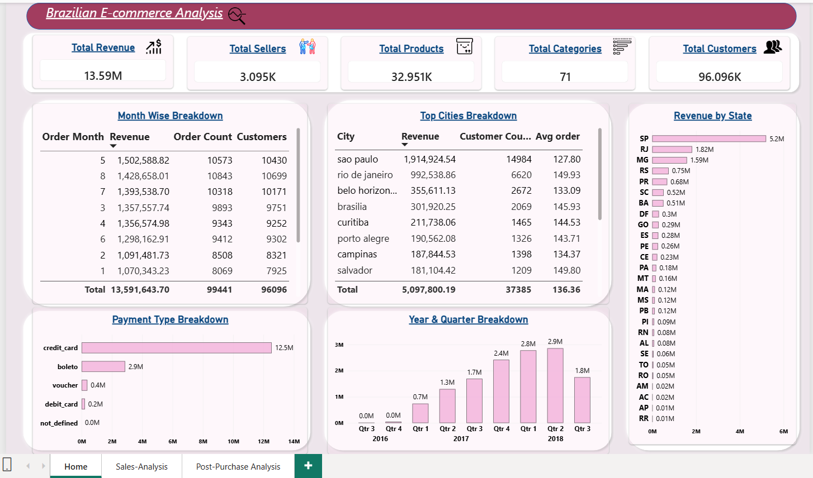
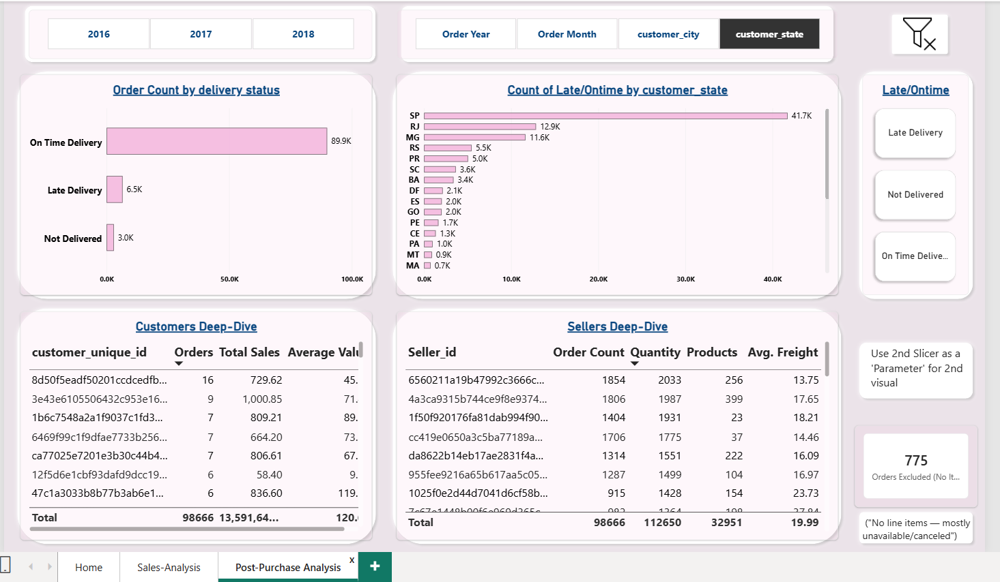

# Brazilian-Ecommerce-PowerBI

An interactive Power BI analysis of the Brazilian Olist e-commerce dataset, covering sales performance, customers, sellers, products, delivery performance, payments, and geographic insights.

## Dashboard Preview

### Home Dashboard



### Sales Analysis



### Post-Purchase Analysis


---

## Project Overview

This project analyzes Brazilian e-commerce transactions from the Olist dataset and presents the findings through an interactive Power BI report.

The report is divided into three major analytical sections:

### 1. Home

Provides an executive overview of:

- Total revenue
- Total sellers
- Total products
- Total categories
- Total customers
- Monthly performance
- Top cities
- Revenue by state
- Payment types
- Year and quarter performance

### 2. Sales Analysis

Focuses on sales performance and commercial insights:

- Revenue by product category
- Revenue by seller
- Revenue by product
- Month-over-month revenue growth
- Order ratings
- State-level review analysis
- Seller performance

### 3. Post-Purchase Analysis

Analyzes what happens after an order is placed:

- On-time deliveries
- Late deliveries
- Undelivered orders
- Delivery performance by state
- Customer deep-dive
- Seller deep-dive
- Excluded orders / orders without line items

---

## Key Metrics

| Metric | Value |
|---|---:|
| Total Revenue | 13.59M |
| Total Sellers | 3.095K |
| Total Products | 32.951K |
| Total Categories | 71 |
| Total Customers | 96.096K |
| Total Orders | 99,441 |

---

## Key Business Analysis

### Sales Performance

The dashboard analyzes:

- Category-level revenue
- Product-level revenue
- Seller-level revenue
- Monthly revenue trends
- Month-over-month growth
- Quarterly performance
- Customer review ratings

### Geographic Analysis

The report provides:

- Revenue by Brazilian state
- Revenue by city
- Customer distribution by state
- State-level delivery performance

### Customer Analysis

Customer deep-dive analysis includes:

- Number of orders
- Total sales
- Average order value
- Customer-level purchasing behavior

### Seller Analysis

Seller performance is analyzed using:

- Order count
- Quantity sold
- Number of products
- Average freight
- Total sales

### Post-Purchase Analysis

Delivery performance is evaluated using:

- On-time delivery
- Late delivery
- Undelivered orders
- State-level delivery outcomes

### Payment Analysis

Revenue is analyzed across:

- Credit card
- Boleto
- Voucher
- Debit card
- Undefined payment types

---

## Power BI Features Used

- DAX measures
- Power Query
- Data modeling
- Interactive slicers
- Cross-filtering
- KPI cards
- Drill-down analysis
- Parameter-style filtering
- Time intelligence
- Month-over-month growth analysis
- Interactive tables
- Business-focused dashboard design

---

## Tools & Technologies

- Power BI
- DAX
- Power Query
- Data Modeling

---

## Dataset

This project uses the publicly available Brazilian Olist E-Commerce dataset.

The dataset contains information related to:

- Orders
- Customers
- Sellers
- Products
- Payments
- Reviews
- Delivery
- Product categories

The raw dataset is not included in this repository.

---

## Project Structure

```text
Brazilian-Ecommerce-PowerBI/
│
├── Brazilian-Ecommerce-PowerBI.pbix
├── README.md
│
└── Screenshots/
    ├── Home.png
    ├── Sales-Analysis.png
    └── Post-Purchase-Analysis.png
